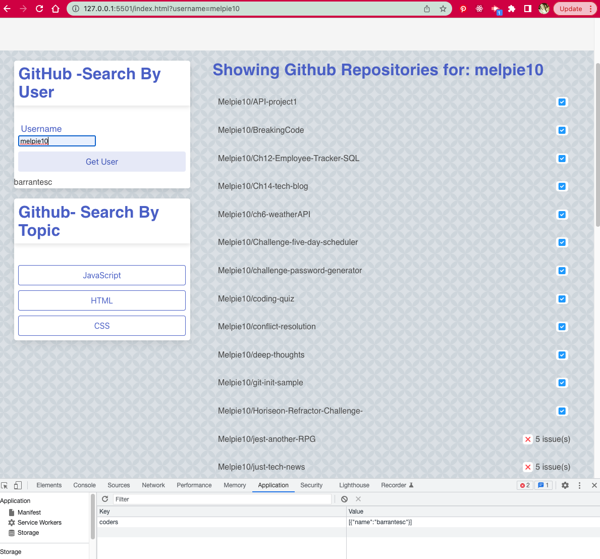
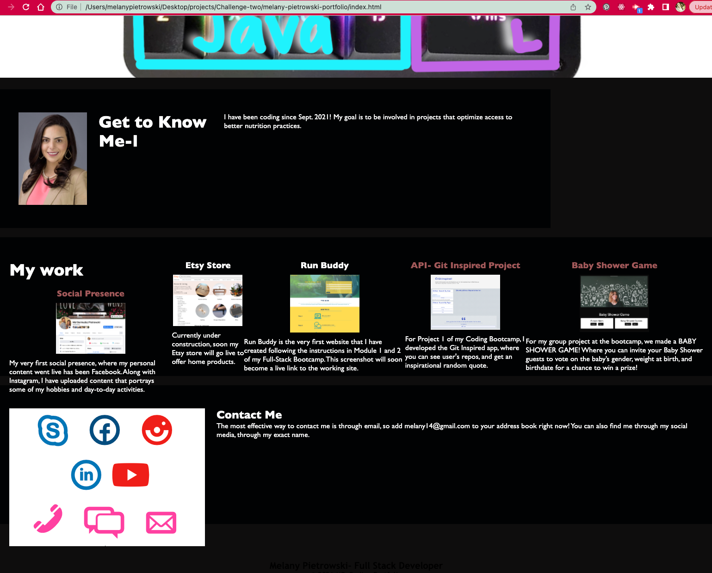

# 📝 API - Local Storage - Git Inspired - Project 1

This app allows you to find GitHub repos by searching for specific GitHub users. If you don't know any by memory, you can find repositories by coding language. When you get very overwhelmed by the extensive amount of code out there, just GIT INSPIRED by the random quote of the day at the bottom of the page. And if you feel like sharing your inspiration with the world, go ahead and tweet your new findings. 

# Description

USER STORY: 
As a coder, I want to visit the website and input a github username I am presented a list of their repositories. 
If I am interested in finding repositories by HTML, JAvascript, or CSS, I can pick the language button and see  repositories about them. 
When I get overwhelmed, I just look at the Random quote at the bottom and find joy in life again. 
If I want to share with the world, I click on the tweeter button and share from my own account. 

# Technology used

* Bulma was used to re-style the page.
* Github API
* Random Quote Generator API
* Local Storage
* HTML, CSS, Javascript

# Project Requirements

* Use a Framework other than Bootstrap- I used BULMA.
* Be interactive (i.e., accept and respond to user input) - This app accepts input from the user - takes in github username, allows the user to pick a coding language, and allows the user to interact with the Random Quote of the day, by having a link for you to tweet the quote of your choice.  
* 2 server-side API - I used Random Quote Generator & Github API for the repos.
* Uses local storage to store persistent data.
* Is responsive- Bulma allows the website to be responsive to different screen sizes.
* Have a polished UI- changed the look of the page. 
* Project is added to personal portfolio- updated.
* Have quality README

# Access

* Project is deployed to Github pages at: https://melpie10.github.io/API-Project-Git-Inspired/

* Presentation video: https://drive.google.com/file/d/1I397g1buxU63A4dCrg9NiL2RnzVLNoGS/view

* Demonstration video: https://drive.google.com/file/d/1XRFN_o_QSSSQokLgIvQgMopaWHWTtEyk/view

* My updated portfolio with the Git Inspired app: https://melpie10.github.io/melany-pietrowski-portfolio/

# Visuals

* The website looks like this when opened on Google Chrome: 
 

 * A picture of my updated portfolio with Git Inspired added
 

 ## Contributing

Pull requests are welcomed. If you would like to suggest major/significant changes, please open a comment to suggest changes. 

## Support

📫  If you would like to contact me, please email melany14@gmail.com.

## Roadmap

In the future, this project will be fixed so local storage and API calls work concurrently. 